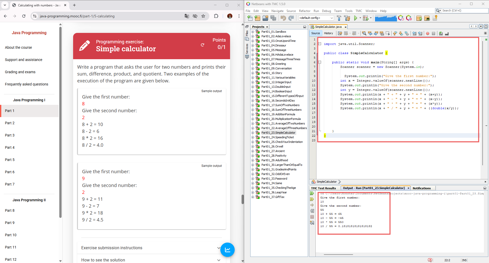
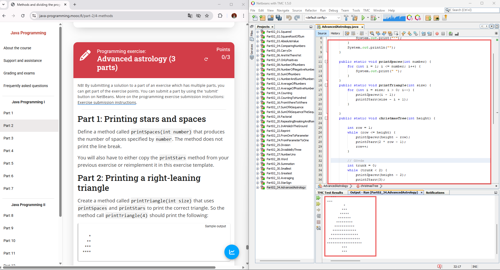
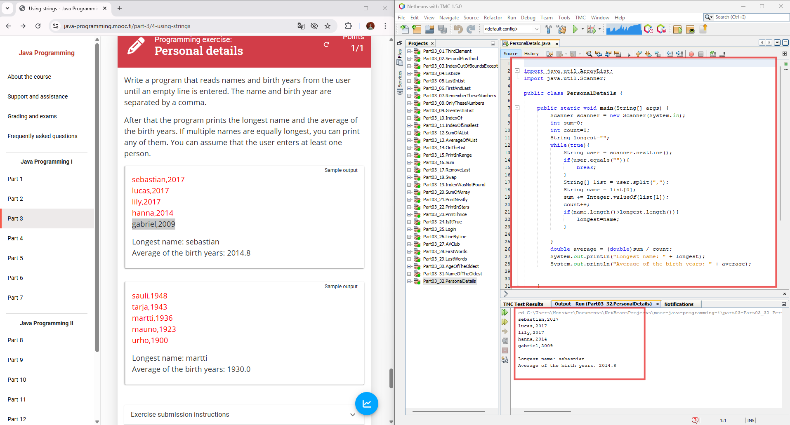
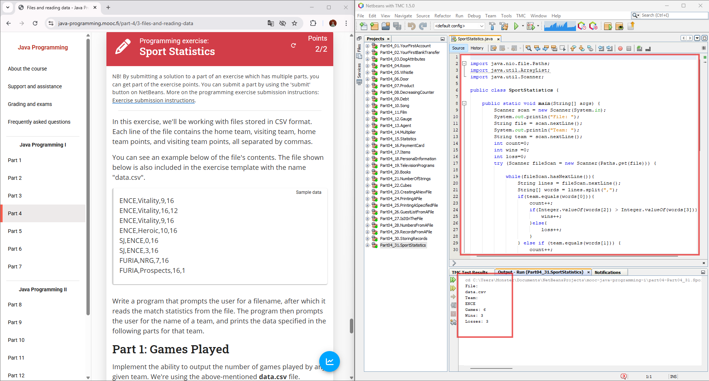
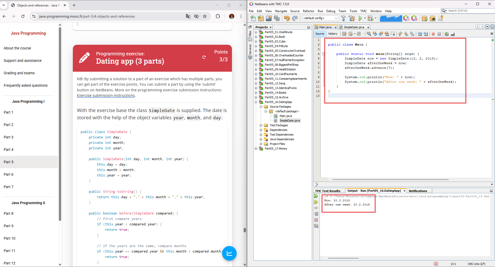
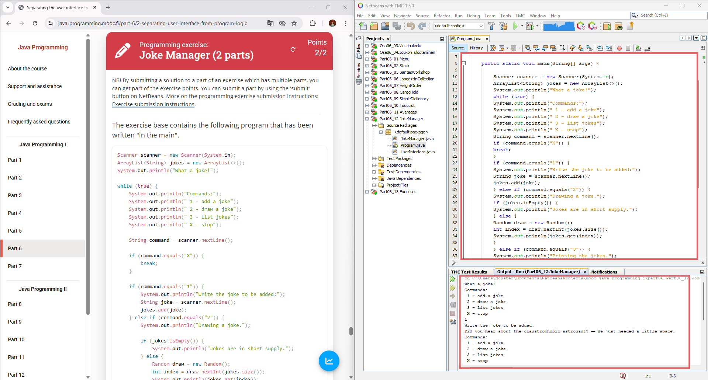
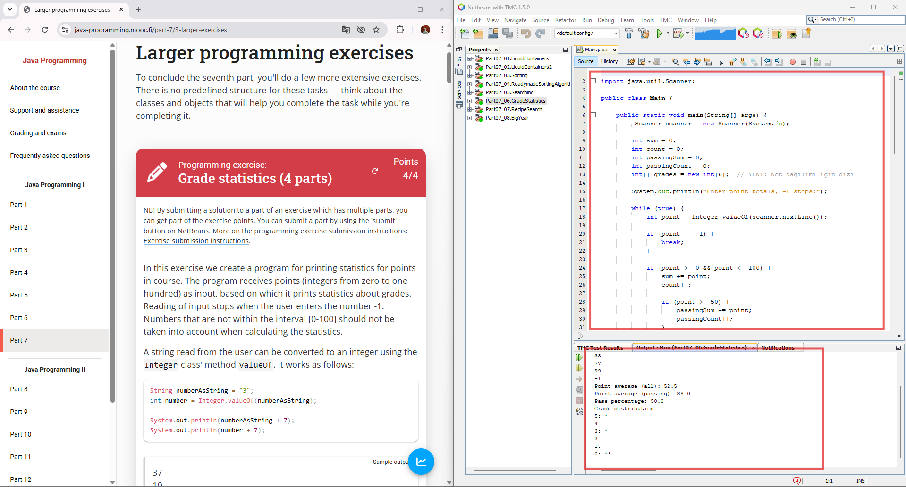
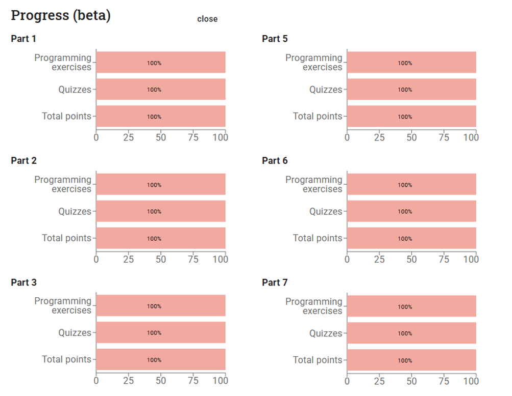
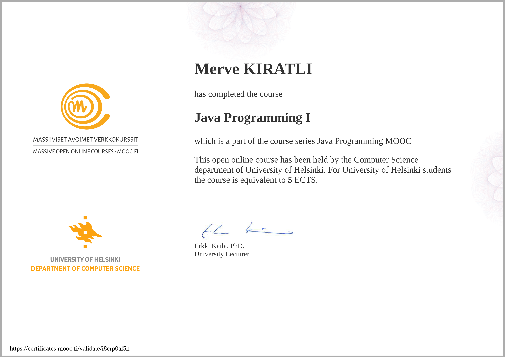

# ☕ Java Programming MOOC - Part 1

### University of Helsinki | Complete Solutions (Parts 1-7) | Object-Oriented Programming Fundamentals

---

## 📌 About the Project

A comprehensive collection of **complete solutions** to the University of Helsinki's Java Programming MOOC - Part 1 (Parts 1-7). This project represents one of the most fundamental milestones in my programming journey, transitioning from zero programming knowledge to understanding core Java concepts and object-oriented programming principles.

Completed by following the intensive course offered by [University of Helsinki](https://java-programming.mooc.fi/), not just by watching videos but by actively coding, testing, and debugging every single exercise. Each solution was carefully crafted to pass automated tests while maintaining code quality and readability.

🏆 **[View My Official Certificate](https://certificates.mooc.fi/validate/i8crp0al5h)** - Certified by University of Helsinki

This course aims to teach **professional programming practices** from day one, using industry-standard tools, automated testing systems, and real-world problem-solving approaches.

My goal was not just to "complete exercises" — I wanted to **deeply understand** programming fundamentals, algorithmic thinking, object-oriented design, and software development best practices. I focused on clean code, proper naming conventions, and building a strong foundation throughout the process.

---

## 🛠️ Screenshots


*First steps in Java: printing, variables, and conditional statements*


*Mastering repetition with while/for loops and creating reusable methods*


*Working with ArrayLists, arrays, and string manipulation*


*Creating classes, objects, and understanding OOP basics*


*Method overloading, object equality, and encapsulation*


*Reading files, separating UI logic, and exception handling*


*Implementing search/sort algorithms and grade distribution system*


*Automated testing results showing 100% pass rate*


*University of Helsinki MOOC Certificate of Completion*

---

## 🚀 What This Project Taught Me

- Writing **clean, readable, and maintainable code**
- Understanding **object-oriented programming principles**
- Working with **IDE tools** (NetBeans/IntelliJ IDEA)
- Implementing **automated testing** with Test My Code
- Mastering **data structures** (ArrayLists, Arrays, Strings)
- Building **reusable methods** and proper code organization
- Applying **algorithmic thinking** to solve problems
- Reading and **processing files** in Java

---

## 🛠️ Technologies Used

- Java 11+
- NetBeans / IntelliJ IDEA – Integrated Development Environment
- Test My Code (TMC) – Automated Testing Platform
- JUnit – Unit Testing Framework
- Git & GitHub – Version Control
- Object-Oriented Programming Principles
- Algorithm Design & Implementation

---

## 📂 Project Structure

### **java-programming-mooc-part1/**
| Folder                  | Description                                                 |
|-------------------------|-------------------------------------------------------------|
| **Part_1**              | → Getting Started with Programming                          |
|                         | → Printing, Variables, Reading Input                        |
|                         | → Conditional Statements (if-else)                          |
| **Part_2**              | → Repeating Functionality                                   |
|                         | → While & For Loops                                         |
|                         | → Methods and Code Reusability                              |
| **Part_3**              | → Lists and Arrays                                          |
|                         | → ArrayList Operations                                      |
|                         | → String Manipulation & Processing                          |
| **Part_4**              | → Introduction to Object-Oriented Programming               |
|                         | → Classes and Objects                                       |
|                         | → Constructors and Object References                        |
| **Part_5**              | → Learning Object-Oriented Programming                      |
|                         | → Method Overloading                                        |
|                         | → Object Equality & toString()                              |
| **Part_6**              | → Separating UI from Logic                                  |
|                         | → Objects in Lists                                          |
|                         | → Reading Files & Exception Handling                        |
| **Part_7**              | → Algorithms                                                |
|                         | → Searching and Sorting                                     |
|                         | → Grade Distribution System                                 |

---

## 📊 Course Content Breakdown

| Part | Topics Covered | Exercise Count | Key Concepts |
|------|---------------|----------------|--------------|
| **Part 1** | Getting Started with Programming | ~25 exercises | Variables, Input/Output, Conditionals |
| **Part 2** | Repeating Functionality | ~30 exercises | Loops (while/for), Methods, Parameters |
| **Part 3** | Lists and Arrays | ~25 exercises | ArrayList, Arrays, String Operations |
| **Part 4** | Object-Oriented Programming | ~20 exercises | Classes, Objects, Constructors |
| **Part 5** | Learning OOP | ~20 exercises | Overloading, Encapsulation, Equality |
| **Part 6** | Separating UI from Logic | ~15 exercises | File I/O, UI Separation, Error Handling |
| **Part 7** | Algorithms | ~15 exercises | Sorting, Searching, Statistical Analysis |

**Total: 150+ exercises completed and tested**

---

## 🎯 Core Concepts Mastered

### Programming Fundamentals
- ✅ **Variables & Data Types**: int, double, String, boolean
- ✅ **Operators**: Arithmetic, comparison, logical operators
- ✅ **Control Flow**: if-else statements, switch cases
- ✅ **Loops**: while loops, for loops, break & continue
- ✅ **Methods**: Parameters, return values, method signatures

### Object-Oriented Programming
- ✅ **Classes & Objects**: Creating and using custom classes
- ✅ **Constructors**: Default and parameterized constructors
- ✅ **Encapsulation**: Private attributes, public methods
- ✅ **Method Overloading**: Multiple constructors and methods
- ✅ **toString() Method**: String representation of objects
- ✅ **Object References**: Understanding memory and references

### Data Structures
- ✅ **ArrayList**: Dynamic lists, add/remove operations
- ✅ **Arrays**: Fixed-size collections, iteration
- ✅ **Strings**: Manipulation, parsing, formatting
- ✅ **Collections**: Working with multiple objects

### Advanced Topics
- ✅ **File Operations**: Reading files, Scanner usage
- ✅ **Exception Handling**: try-catch blocks, error management
- ✅ **Algorithms**: Searching, sorting, filtering
- ✅ **User Interfaces**: Text-based menu systems
- ✅ **Code Organization**: Separating logic from presentation

---

## 📈 Learning Progress

```
Part 1: ████████████████████ 100% (25/25 exercises)
Part 2: ████████████████████ 100% (30/30 exercises)
Part 3: ████████████████████ 100% (25/25 exercises)
Part 4: ████████████████████ 100% (20/20 exercises)
Part 5: ████████████████████ 100% (20/20 exercises)
Part 6: ████████████████████ 100% (15/15 exercises)
Part 7: ████████████████████ 100% (15/15 exercises)
```

**Overall Completion: 100% ✅**

---

## 🧠 Final Thoughts

This project represents the foundation of my programming journey through the **University of Helsinki's renowned Java MOOC**.  
Throughout the process, I continuously challenged myself to:

- ✅ Write clean, well-documented code
- ✅ Understand concepts deeply rather than just passing tests
- ✅ Refactor and improve solutions for better readability
- ✅ Apply object-oriented principles consistently
- ✅ Think algorithmically and solve problems efficiently

> I consider this course as more than just a learning resource—it's a **solid foundation** for my career as a software developer.

---

## 📎 Resources & Links

- 🎓 **Official Course**: [java-programming.mooc.fi](https://java-programming.mooc.fi/)
- 🧪 **Test My Code Platform**: [tmc.mooc.fi](https://tmc.mooc.fi/)
- 📚 **Java Documentation**: [Oracle Java Docs](https://docs.oracle.com/en/java/)
- 💬 **MOOC Community**: [Discord Server](https://discord.gg/mooc-fi)
- 📧 **Contact**: [LinkedIn – Merve Kıratlı](https://www.linkedin.com/in/merve-kiratli-0b049a187)

---

## 🙏 Special Thanks

Huge thanks to the **University of Helsinki** and the entire **MOOC.fi team** for creating this exceptional free course.  
The **comprehensive materials**, **automated testing system**, and **supportive community** created an ideal environment for learning programming from scratch.

---

## ⚠️ Academic Integrity Note

**This repository is intended for educational reference and portfolio purposes only.**

If you're currently enrolled in this course:
- 🚫 Do not copy solutions directly
- ✅ Use this as a reference after attempting problems yourself
- 💡 Compare approaches and learn from different implementations
- 🤝 Maintain academic honesty and integrity

**Learning happens through struggle and problem-solving, not through copying!**

---

## ⭐️ For Recruiters

If you're searching for a developer who is:

- 🧠 Passionate about learning and continuous improvement
- 👩‍💻 Committed to writing clean, maintainable code
- 🎯 Focused on understanding fundamentals deeply
- 🛠️ Familiar with object-oriented programming and best practices

Feel free to connect.  
**Let's build something great together!** 🚀

---

## 📊 Project Statistics

| Metric | Value |
|--------|-------|
| **Total Parts** | 7 |
| **Total Exercises** | 150+ |
| **Lines of Code** | ~5,000+ |
| **Completion Rate** | 100% |
| **Time Invested** | ~70 hours |
| **Testing Method** | Automated (TMC) |
| **Status** | ✅ Completed & Certified |

---

## 🔗 Connect With Me

[](https://github.com/mrvekratl)
[](https://www.linkedin.com/in/merve-kiratli-0b049a187)

---

<div align="center">

**Built with ❤️ and lots of ☕ while learning Java**


</div>
